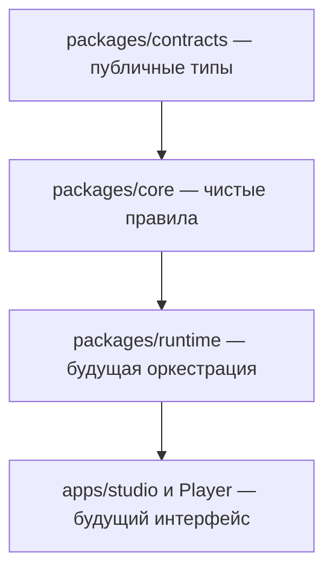

# Sandbox Engine

Переносимый движок для причинных интерактивных историй: автор задаёт мир, действия и постановку, игрок формулирует решения свободным текстом, а изменить состояние могут только проверенные правила. Репозиторий движка развивается отдельно от приложения `conradipui-glitch/sandbox`.

> **Текущий статус:** bootstrap-слой. Контракты и чистое ядро имеют минимальный рабочий срез; Runtime API, Studio, Player, хранилище, провайдеры ИИ и плагины ещё не реализованы.

## Зачем отдельный репозиторий

Движок должен стать переиспользуемой платформой для нескольких историй, а не набором особенностей одной кампании. Границы зафиксированы в [полном ТЗ](docs/SPECIFICATION.md). Ближайшая продуктовая цель — playable MVP к рабочей дате команды 14 октября 2026 года; это не означает, что к этой дате нужно строить всю платформу.

## Быстрый старт

Требуется Node.js `24.19.0` и npm `11.9.0`.

```bash
npm ci
npm run verify
```

`verify` сейчас действительно проверяет TypeScript, контрактные тесты, чистоту границы Core и навигацию документации. Это не заявление, что будущие группы `test:api`, `test:ai` или `test:e2e` уже существуют.

## Карта репозитория



- `packages/contracts` — первый слой DTO и различение игровых/обрабатывающих статусов.
- `packages/core` — вычисления без сети и инфраструктуры.
- `docs/` — ТЗ, решения, baseline, MVP-приоритеты, задачи и журнал передачи.
- `apps/`, `packages/runtime`, `packages/player`, `plugins/`, `examples/` — зарезервированные границы, которые добавляются только вместе с конкретной задачей.

## Как продолжить в новом чате

Открой [HANDOFF](docs/HANDOFF.md), выполни указанную там одну задачу и прочитай только связанные разделы ТЗ. После работы обнови `STATUS`, `HANDOFF` и журнал. Если контекст закончился, следующий агент должен суметь продолжить по этим файлам и истории commit без пересказа чата.

## Команда и роли

Предлагаемое распределение ответственности описано в [TEAM.md](docs/TEAM.md): продукт и стандарт контента, разработка движка, дизайн/PM/плейтест. Имена и окончательные договорённости команда утверждает сама.

## Связанные проекты

- [Действующая игра и Florence](https://github.com/conradipui-glitch/sandbox)
- [Проверенный исходный commit для аудита](https://github.com/conradipui-glitch/sandbox/commit/092bcef0be5943e32bf02f08f9e9d4cde393fa95)

Лицензия и модель публикации пока не выбраны владельцем проекта.

